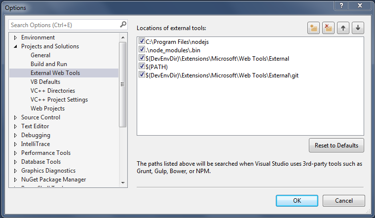

Visual Studio is a fantastic IDE (and [free](https://www.visualstudio.com/downloads/download-visual-studio-vs) for individual use)! It's been so great that they've added modern web dev support in recent years for things like React, Webpack, and more. In addition, Visual Studio's installer has an option to install Node.js as part of its regular installation in order to support the npm task runners that are built in. However, I ran into an issue I updated [Node.js](https://nodejs.org) outside of Visual Studio , but **since Visual Studio uses its own install that is separate from any outside installation, you can potentially run into a node_modules package dependency issue where one version of npm installs a package (which makes it rely on that version of Node/npm), and then you can't run commands in the other version (they break).**

Specifically, I had an issue with node-sass and windows bindings. The solution was to point Visual Studio to the version of Node.JS that I had already set up externally to Visual Studio. Here's how to synchronize them:
<!--more-->

### Step 1: Find the Node.js install location

First, find the Node.js installation that you use on the command line. By default, Node.js installs to `C:\Program Files\nodejs`. Unless you picked a custom installation directory when you initially installed Node.js, this is likely the path you'll use.

Once you've found the installation directory, copy that directory path to your clipboard for a future step.

### Step 2: Configure Visual Studio
Let's setup up Visual Studio to point to the *real* Node.js
> Note: These instructions work on Visual Studio 2015, 2017, 2019, and probably future versions as well.

To configure Visual Studio to use a different version of Node.js, first **open Visual Studio and navigate to Tools > Options**. 

In this dialog, go to **Projects and Solutions > External Web Tools** to open the dialog that manages all of the 3rd party tools used within Visual Studio.  This is where Visual Studio is configured to point to a specific version of Node.js.

**Add an entry at the top to the path to the Node.js directory to force Visual Studio to use that version instead.**

#### Using the Windows PATH Instead

If you're making this change, you probably notice that you can also move the `$(PATH)` option up to tell Visual Studio to look at the PATH environment variable to determine where it should look for `node` or other command line tools. This is probably what you want globally if you're someone who is comfortable with the command line and understand the implications. 

In general it seems that Visual Studio tries to isolate itself and the tools it uses from both other installs of Visual Studio and anything else that may cause issue with it. In general, Visual Studio developers have not traditionally had to touch the command line much, so this makes sense historically, but modern web applications require a different approach.

#### Managing switching the Node.js Version using Powershell

Another issue that might arise due to using the `$(PATH)` is that you might have projects that use different versions of Node.js. For example one might use Node.js 8.x.x, while another uses 10.x.x. In this case you might want to use [Node Version Manager](https://github.com/aaronpowell/ps-nvm), or "NVM" as it's called, to switch versions on the command line in powershell.

 You can use NVM to switch versions of Node.js yourself on the command line, or use it to read the package.json file's "Engine" property, and sets the appropriate version. If the version isn't available it can even silently install the appropriate Node.js version. This is helpful in many situations, and can be included in an MSBuild task if needed to swap the version when you hit the "Play" button to the correct version, or as a step in your CI/CD build process.

### Wrapping Up

And that's it!  Now you're all synced up!  Having two separate installs is really confusing.  If you're starting out with JUST the VS Node.js version, you'll eventually come to a point where you may update node.js by installing it outside VS, causing it to get out of sync anyway. If you're a veteran to Node.js, then you're already using Node outside of Visual Studio and will need to do this anyway. It seems like there should be better documentation or indicators to show what version VS is using so this is more apparent.

Hope that helped.  Did this fix it for you?  Do you have a better way of keeping this in sync or a plugin/tool to help out?  Let us know in the comments!
