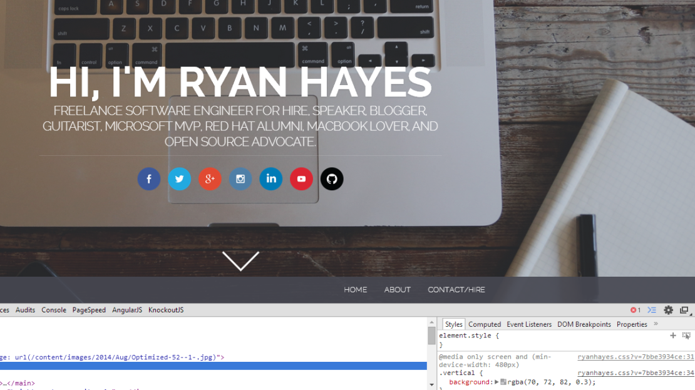

If you've been to any new websites lately, you'll know that [parallax scrolling](https://en.wikipedia.org/wiki/Parallax_scrolling) and large background images are incredibly popular right now. They're great because they are able to help better tell stories, with big, gorgeous photos on the background and relevant text in the foreground overlaying those images as you scroll.

Responsive design means that the text overlaying these photos can move around. One of the challenges in this is that you're likely to run into an issue where you have the text the same color as the image behind it. There are a couple of ways to deal with this, but let me show you my personal favorite.

There is a relatively newer CSS property that you can apply to a background where you can overlay it with a color and specify the opacity (seethrough-ness). Using this is a _great_ way to darken the background just enough to make white text more readable and pop. Here's an example of the before and after shot on my blog:

## Let's look at some text on a background that is too light

Here's the original background photo. You can see that on the right side of the Macbook that **the photo clashes with the white text and makes it really hard to read.**:


That's because we need more contrast. The image is far too light, and while most of us can read it, people with older monitors with bad constrast or with vision challenges can have a hard time reading the text. We need to either change the text (which I don't want to do), or make the background image darker, which I *do* want to do. Let's do this using only CSS.

## How to darken the background image using CSS

What we want to do is create a div that overlays the background image entirely, and then  **add an rbga background property in order to make it act as a filter over top of the image.** Here's the code where the first 3 parameters are the standard red, green, blue values to create the color (gray in this case), and the last parameter determines the opacity, or how see-through you want the div.:

```css
    .someDivOverlay {
       background: rgba(70, 72, 82, 0.3)
    }
```
    
Here's what it looks like when we've added the overlay. You can see you can make out the text _much_ more clearly on the right-hand side. Since the overlay in this case is gray and very light, **it adds just enough to be able to read without taking away the ability for the background image to really be a part of the story.** Take a look!:



### Why not just modify the image itself?

Well, there are a couple of reasons you may want this:

It means the browser can download a single background image, cache it, use it in multiple places, but still be able to use multiple colors in certain situations. An example is by using media queries where you can make `if` statements in your CSS so that you could even have darker filters on mobile vs tablet, vs desktop if the image is placed in a different spot due to responsive design. You can use this technique to darken only the ones you need, but still only have a single image being served

Anther reason you may want this is if you are serving an image from an external site via an API, such as Facebook or Instagram. You can use this CSS as well as others to create your own image filters and even get a little crazy - all within the browser. That means you don't have to modify the original image or do any server-side manipulation, which is great for scalability, but also ensures you conserve the original image while saving bandwidth and storage space if that's something you need.

Are there any other similar CSS tricks you've found to save yourself from having to edit the original image in Photoshop multiple times?
