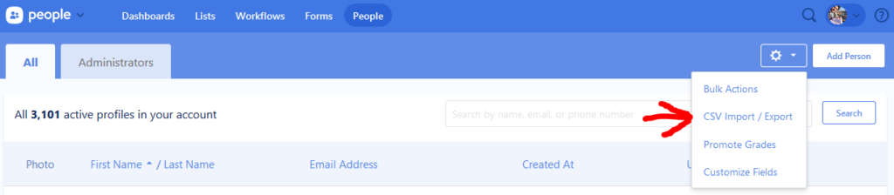

I run the software systems for [Harvest Community Church](https://harvesttn.com/) and also play guitar for our 3 services on Sunday.  We've been using Planning Center's Services app to schedule and manage our Sunday mornings for almost a decade. Recently Harvest moved from Rock RMS to PCO, and it's been great, but I want to explain why we made the move and how to do it mostly seamlessly.

## Why we switched to Planning Center from Rock RMS

One huge reason we picked Rock RMS initially was that it was open source. In the church, there are so many places where you can volunteer, and having an entire church management system that's open source is an incredible opportunity to put development talents to use. We set up the database, deployed Rock to Azure, and away we went. Over time, the amount of technical maintenance and configuration it required ended up being too much overhead for our mostly non-technical volunteers. We ended up not having the usage required for it to be worth it, and the teams using Planning Center had a markedly higher engagement rate.

In addition, we Rock tended to require the volunteers and users to have a higher degree of technical capabilities. Considering this, we decided that a move to Planning Center Online was the right choice, at least for now.

# How to migrate

## Rock RMS Database export script

Below is the database script I used to extract the data needed from RockRMS and get it in the format needed for a Planning Center Online import.

`gist:RyannosaurusRex/1bca0a9dc4e76a0d50640548ab3c38e5#RockRmsExportToPCO.sql`

## Extract the data from Rock RMS

Keep in mind that this script has a "SELECT TOP(1000)" at the top because we had A LOT of data. It's easier to test your export if you don't pull out everyone every time. When ready, you'll want to replace "SELECT TOP(1000)" WITH "*" in order to pull all of the records.

You'll notice that some of the lines are commented out for the migration from Rock RMS to PCO. These records we ended up not needing or were unused. If you do need them, those names are what PCO is looking for, so just add to the script to pull those additional pieces if needed.

Once you have the data extracted, you'll need to get it into a CSV format. I like to use [Azure Data Studio (Download here)](https://docs.microsoft.com/en-us/sql/azure-data-studio/download?view=sql-server-2017) to connect to the database and run the query because you can save the results of the above query as a CSV, which is the format Planning Center needs in order to do an import.

## Importing into Planning Center Online

Once you have the data in a .csv file, log into your Planning Center account, go to the People app, and select CSV Import / Export and upload your file.

Once the file is uploaded, you can review the import. You can revert it within the first few hours in case things don't look quite.

## Cleanup and Gotchas

From there, you may need to merge some people if you already have folks in the system. Keep an eye out for any Services people that you merge and make *sure the email they used in Services remains their primary email*. If it doesn't, they may stop getting notifications for when they're scheduled to serve or be unable to log in.

Hope this helps your Rock RMS to Planning Center Online migration go a little more smoothly!